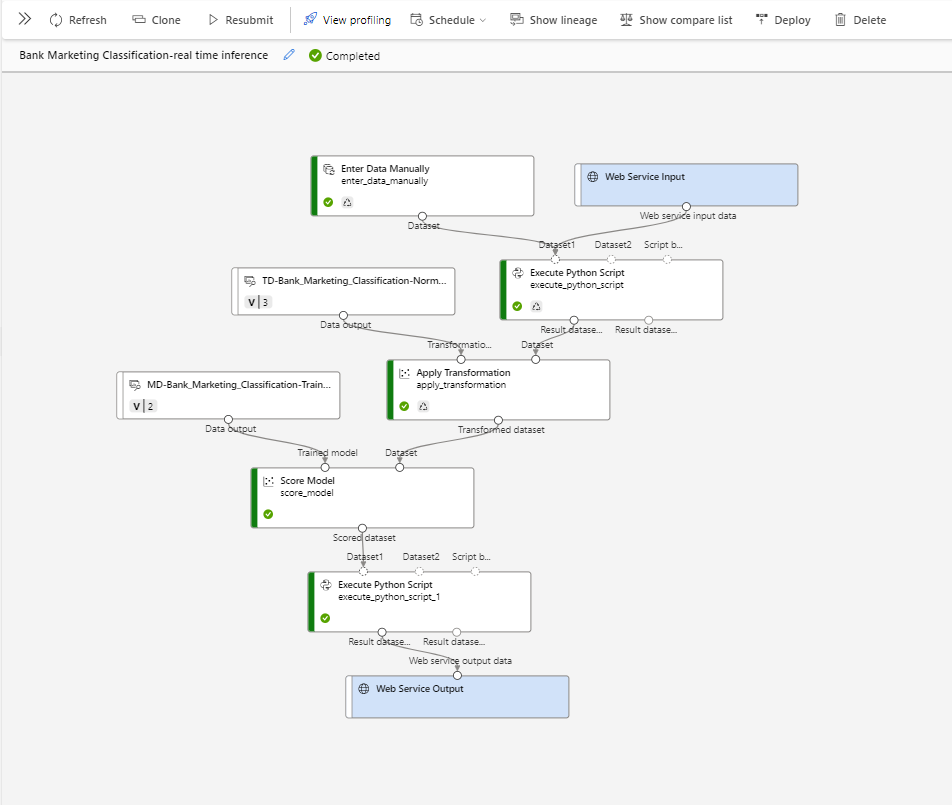

# Predicting Customer Outcomes using Classification Algorithms and Azure ML Studio

## Overview
This project used ensemble machine learning algorithms to predict customer subscriptions to financial products offered by a Portuguese Bank. The goal was to conduct a comprehensive analysis from end to end, extracting valuable insights into customer behavior and preferences.

## Dataset
The dataset used in this study contained information gathered from a marketing campaign conducted by a Portuguese bank between May 2008 and November 2010. It comprises 40,000 instances with 20 input features relating to customer demographics, engagement, and marketing outcomes.

## Phases and Methodology
The project was executed in various stages, including:
- Preprocessing and data cleaning.
- Exploratory analysis.
- Feature engineering.
- Implementation and evaluation of machine learning models such as decision trees, logistic regression, random forest, and XGBoost.

## Azure ML Deployment
The Azure Machine Learning Designer was also used to create and deploy some of the models. Key steps included:
- Pipeline development and implementation of models like Neural Networks and SVM.
- Model evaluation using key metrics; the Neural Network showed superior performance.
- Configuration of an inference pipeline and deployment of the model as a web service for real-time predictions.

